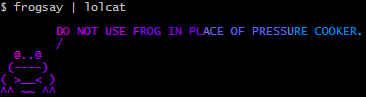

=======
Frogsay
=======

::

         FROGSAY IS A PROGRAM THAT GENERATES AN ASCII PICTURE OF A FROG
         SPOUTING A FROG TIP. FROG TIPS ARE FETCHED FROM
         HTTP://FROG.TIPS'S API ENDPOINT. TO USE, INSTALL VIA PIP: 'PIP
         INSTALL FROGSAY' AND THEN RUN 'FROGSAY'
         /
   @..@
  (----)
 ( >__< )
 ^^ ~~ ^^

.. image:: https://img.shields.io/pypi/v/frogsay.svg
    :target: https://pypi.python.org/pypi/frogsay

-----------
Quick start
-----------

::

    pip install frogsay

then

::

    frogsay

or you can obviously do something like

